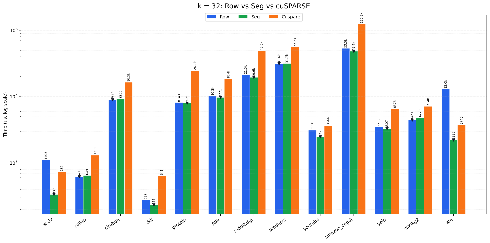
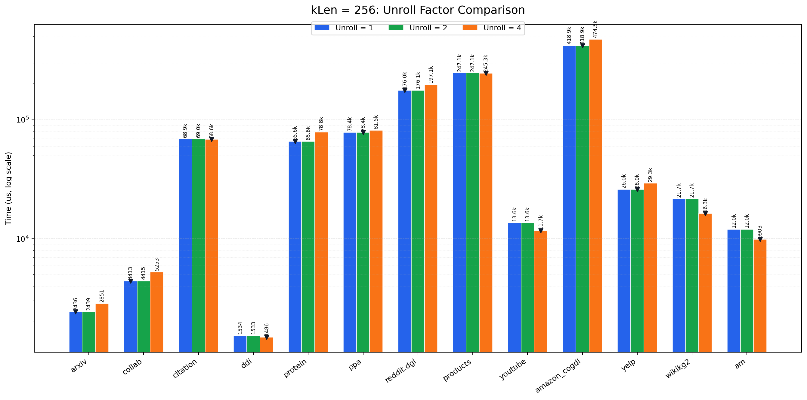

# 稀疏矩阵-矩阵乘

王宇康 计51 2024010091  

## 实现方法  

当前算法主要针对 K = 32 和 K = 256 两种长度设计 Kernel 函数，整体思路是：一个 warp 处理一行或者一个固定长度的非零元片段，使 32 个线程同时计算一行中的 32 列，并且通过将长段进行切割分段，降低长短行差异导致的 load imblance  

整体执行路径如下：

```text
preprocess:
    复制 ptr 到 host
    统计 total_nnz
    如果 K = 32 且数据集适合 row kernel:
        不生成分段元数据
    否则:
        每行第一个最多 256 nnz 记入 first_*
        剩余 nnz 按 256 一段记入 rest_*

run:
    如果 K = 32:
        部分数据集使用 spmm32Row
        其他数据集使用 spmm32Seg<false> + spmm32Seg<true>
    如果 K = 256 或其他:
        根据数据集选择 UNROLL
        使用 spmm256Seg<UNROLL, false> + spmm256Seg<UNROLL, true>
```

**核心优化点**：
1. 使用 warp 作为基本计算单位，`block.x = 32`，warp 内所有线程处理同一个 row 或同一个 segment，使得不同线程不会因行长度不同而走不同循环路径，保证循环次数一致，从而减少 warp divergence
2. 对大多数数据集按照 256 个非零元切分 segment，避免超长行拖慢单个线程或者单个 warp，将每个 block 的工作量限制在相近范围内，分段的策略能够将 load imbalance 从线程级别降低到 block 上，并且还能保证 divergence 最多只发生在每个 segment 尾部最后一个 32 元块，尽可能的减小 warp divergence 的影响
3. 但由此带来多个 warp 同时写入一个输出的问题，引发写冲突，需要使用 atomicAdd，这引入了新的开销，但从整体上来说是对性能有帮助的
4. 为了平衡分段与 atomicAdd 的开销，我对于 K = 32 和 K = 256 的采用了专门的 Kernel 函数，并根据数级集的特点选用专门的处理策略
5. 将每一行的第一个 segment 和剩余 segment 分开处理，先执行 first segment，first segment 可以直接输出，而如果有 rest segment，再进行 atomicAdd，这样可以最大程度上减少 atomidAdd 带来的串行问题
6. 对部分 `K = 32` 数据集使用 `row kernel`，即不做分段，减少 atomicAdd 的开销
7. 对于 `K = 256` 的情况，使用 `UNROLL = 1/2/4`，让一个线程同时处理 `1/2/4` 个列计算，可以提高每次稀疏数据加载后的复用度，但相应使用的 warp 数量也会有所降低，仅是在数据复用和占有率之间做折中
8. 在缓存利用上，Kernel 函数中使用两个 shared memory 来储当前 warp 正在处理的 32 连续的个 val/idx，供 32 个线程和 unroll 循环复用

## 优化效果

对于 K = 32 时：
- `row kernel`：不做分段，一个 warp 处理一行
- `seg kernel`：将长行按照 seg = 256 进行切分
- `cuSparse`：对照



可以看出，对于不同类型的数据适合不同的策略，但大部分都会比 cuSparse 实现效果好，说明处理方式是对的，仅是在不同开销之间的折中权衡问题

对于 K = 256 时：
- `Unroll = 1`：一个线程处理一个元素
- `Unroll = 2`：一个线程处理两个元素
- `Unroll = 4`：一个线程处理三个元素



从图中可以知道 Unroll 不是越大越好，因为更大的 Unroll 也会带来更大的寄存器压力，单线程更多的指令，以及使用更少的线程导致的占有率降低，能带来不算显著的性能提升

## 运行时间及加速比

**K = 32**
- 平均吞吐为 4.76e9

| Dataset | Time(spmm_cusparse) | Time(spmm_opt) | 加速比 |
| --- | --- | --- | --- |
| arxiv | 757.85 us | 344.35 us | 2.20 |
| collab | 1310.59 us | 620.60 us | 2.11 |
| citation | 16442.00 us | 8987.53 us | 1.83 |
| ddi | 640.81 us | 233.40 us | 2.75 |
| protein | 24644.30 us | 8031.15 us | 3.07 |
| ppa | 18369.00 us | 9772.50 us | 1.88 |
| reddit.dgl | 48566.80 us | 19602.90 us | 2.48 |
| products | 55835.40 us | 31736.60 us | 1.76 |
| youtube | 3644.28 us | 2473.88 us | 1.47 |
| amazon_cogdl | 125281.00 us | 48423.90 us | 2.59 |
| yelp | 6574.73 us | 3306.57 us | 1.99 |
| wikikg2 | 7137.76 us | 4454.73 us | 1.60 |
| am | 3739.91 us | 2224.98 us | 1.68 |

**K = 256**
- 平均吞吐为 7.03e8

| Dataset | Time(spmm_cusparse) | Time(spmm_opt) | 加速比 |
| --- | --- | --- | --- |
| arxiv | 2991.80 us | 2478.21 us | 1.21 | 
| collab | 5204.21 us | 4413.66 us | 1.18 |
| citation | 78885.10 us | 68596.30 us | 1.15 |
| ddi | 1553.54 us | 1487.21 us | 1.04 |
| protein | 80834.10 us | 64959.30 us | 1.24 |
| ppa | 84873.20 us | 78418.90 us | 1.08 |
| reddit.dgl | 202338.00 us | 161403.00 us | 1.25 |
| products | 258281.00 us | 245302.00 us | 1.05 |
| youtube | 14420.80 us | 11724.70 us | 1.23 |
| amazon_cogdl | 517342.00 us | 392315.00 us | 1.32 | 
| yelp | 29991.00 us | 25955.60 us | 1.16 |
| wikikg2 | 16641.00 us | 16282.90 us | 1.02 |
| am | 13388.70 us | 9903.31 us | 1.35 |

总共在 26 个数级集上满足要求

