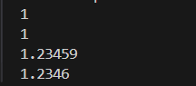

## 输出

在正常情况下输出位数较多的数字(`double`, `float`)时  
整数位多与小数位多时会采用科学计数法，但小数有效位数多时会**四舍五入**，并且保留 **6位有效数字**  

```c++
    double x = 123456789;
    double y = 0.00001234;
    double z = 1.23456789;
    cout << x << endl;
    cout << y << endl;
    cout << z << endl;
```


值得注意的是，`double` 会删去不必要的位数，而 `float` 不会  

```c++
    double x1 = 1.0;
    float x2 = 1.0;
    float y = 1.234595;
    double z = 1.234595;
    cout << x1 << endl;
    cout << x2 << endl;
    cout << y << endl;
    cout << z << endl;
```



而 `int` 则会完整输出 $-2^{31}$ ~ $2^{31} - 1$  

## 控制输出精度

利用 `iomanip` 库中的 `std::fixed` 控制浮点数输出格式，即告诉标准输出流（如 `cout`）将浮点数格式化为固定小数点模式  
再利用 `std::precision()` 控制精度  

如果没有 `std::fixed`，`std::precision()` 为控制有效数字的位数  

[iomanip更多参考](https://www.runoob.com/cplusplus/cpp-libs-iomanip.html)