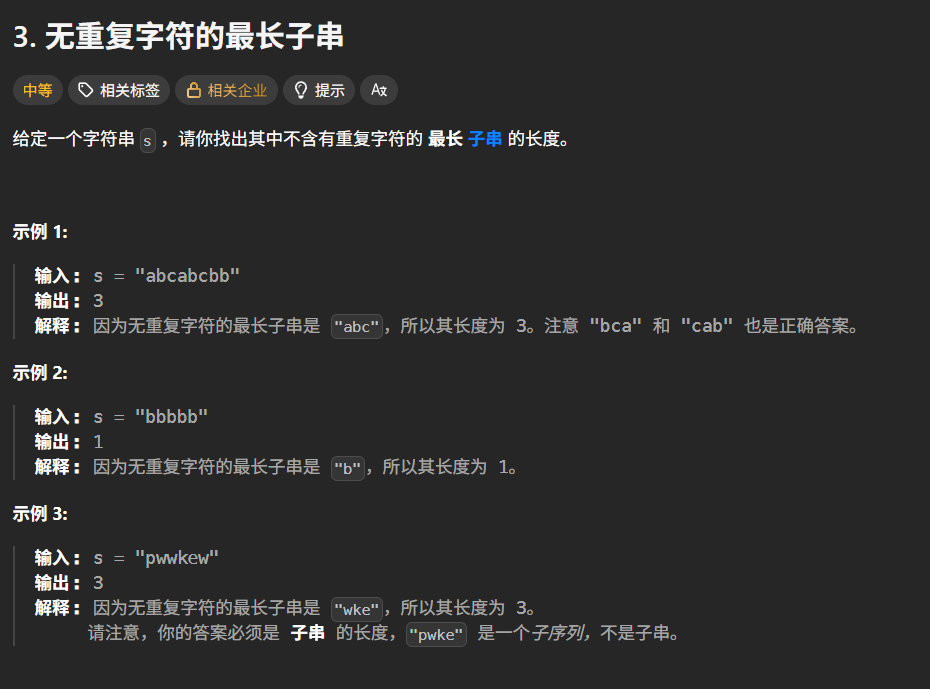
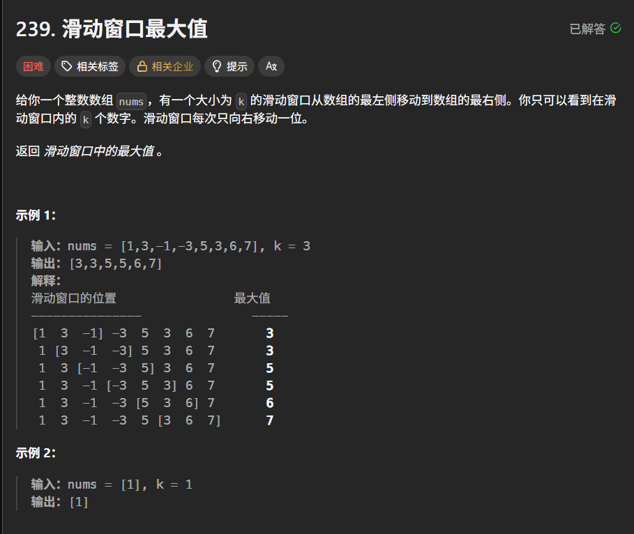

## 双指针

双指针是一个很常用，也很好用的技巧，能显著将嵌套结构的 $O(n^2)$ 复杂度降低到线性 $O(n)$  

例1：盛最多的水  
给定一个数组 $height$，表示 $n$ 条垂线。找两条线，与 $x$ 轴共同构成一个容器，使容纳的水最多  


```C++
int Solve(vector<int>& height) {
    int l = 0, r = height.size() - 1;
    int max_water = 0;
    while (l < r) {
        int cur_h = min(height[l], height[r]);
        max_water = max(max_water, cur_h * (r - l));
        if (height[l] < height[r]) {
            l++；
        } else {
            r--;
        }
    }
    return max_water;
}
```

这题核心逻辑是每次移动高度较矮的一边  
因为面积受限于短板，如果移动长板，宽度变小且高度上限没变，面积只会变小，只有移动短板，才可能遇到更长的板来弥补宽度的损失  

## 滑动窗口

例2：无重复字符的最长子串
找到不包含重复字符的最长子串的长度  



```C++
int Solve(string s) {
    map<char, int> m;
    int res = 0;
    int left = 0, right = 0;
    while (right < s.size()) {
        char c = s[right];
        m[c]++;
        while (m[c] > 1) {
            m[s[left]]--;
            left++;
        }
        right++;
        res = max(res, right - left);
    }
    return res;
}
```

## 单调队列

参考：[单调队列](https://www.bilibili.com/video/BV1bM411X72E/?vd_source=b4729a2d5695d1fdbdee4a304fa6bdea "单调队列") 

例3：滑动窗口最大值
给一个整数数组 nums，有一个大小为 k 的滑动窗口从数组的最左侧移动到数组的最右侧，返回滑动窗口中的最大值



```C++
vector<int> Solve(vector<int>& nums, int k) {
    vector<int> res;
    deque<int> d;
    int n = nums.size();
    for (int i = 0; i < n; i++) {
        while (!d.empty() && d.front() <= i - k) {
            d.pop_front();
        }
        while (!d.empty() && nums[d.back()] <= nums[i]) {
            d.pop_back();
        }
        d.push_back(i);
        if (i >= k - 1) {
            res.push_back(nums[d.front()]);
        }
    }
    return res;
}
```
