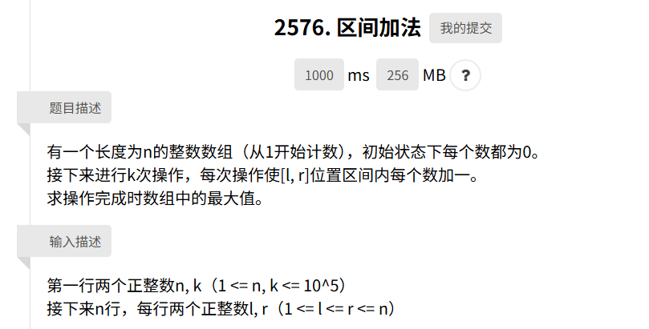
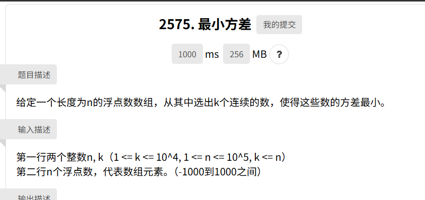

## 前缀和与差分数组

### 差分数组

对于区间批量加法、单词查询最大值的问题常用 **差分数组**  

对于原数组 $A$：$a_1, a_2, a_3, \dots, a_n$，构造一个差分数组 $D$  
- $d_1 = a_1$
- $d_i = a_i - a_{i-1}$ （对于 $i > 1$）

则原数组中的每一个值 $a_i$，都是差分数组 $D$ 前 $i$ 项的前缀和 $a_i = \sum_{j=1}^{i} d_j$  

差分数组的意义在于将区间操作变为了单点修改  
- 常规做法：要把区间 $[l, r]$ 的数全部加 $v$，你需要循环 $r-l+1$ 次，复杂度 $O(n)$
- 差分做法：只需修改差分数组中的两个点，复杂度：$O(1)$
  - D[l] += v（表示从 $l$ 开始，后面的元素都加上了 $v$）
  - D[r + 1] -= v（表示从 $r+1$ 开始，抵消掉前面的加成）

可以这么理解：
$$
\begin{align*}
a_{n} - a_{n - 1} = i 
\begin{cases}
i = -v , &在区间左侧 \\
i = 0 , &在区间内 \\
i = v , &在区间右侧
\end{cases}
\end{align*}
$$  

用两个点表示整个区间的状态，达到快速修改的效果    

比如对于 `interval_add`  
 

```C++
int addInterval(int n, int k) {
    vector<int> nums(n + 2, 0);
    for (int i = 0; i < k; i++) {
        int l, r;
        cin >> l >> r;
        nums[l]++;
        nums[r]--;
    }
    int cur_sum = 0, max = 0;
    for (int i = 1; i < nums.size(); i++) {
        cur_sum += nums[i];
        max = max > cur_sum ? max : cur_sum
    }
}
```

这题很好的体现了区间处理，单次查询的特点，因此将普通做法的 $O(n * k)$ 很好的变成了 $O(n + k)$  

类似的场景还有公交车上人数统计，灯光覆盖等  

### 前缀和

前缀和就算差分的逆运算，通过预处理，把原本需要 $O(n)$ 的区间求和，降级为 $O(1)$ 的减法 $\sum_{i = m}^{n} a_{i} = S_{n} - S_{m}$ 

一般用在需要多次访问区间和的情形，如股市行情查询，计算方差等  

```C++
vector<int> Sum(vector<int>& A) {
    int n = A.size();
    vector<int> S(n, 0);
    for (int i = 1; i <= n; i++) {
        S[i] = S[i-1] + A[i];
    }
    return S;
}
```

同样 `min_variance` 是个很好的例子



```C++
double minVariance(vector<double> nums, int n, int k) {
    vector<double> sums(n + 1, 0);
    vector<double> sums_pow(n + 1, 0);
    for (int i = 0; i < n; i++) {
        sums[i + 1] = sums[i] + nums[i];
        sums_pow[i + 1] = sums_pow[i] + nums[i] * nums[i];
    }
    double min = __DBL_MAX__;
    for (int i = 0; i < n + 1 - k; i++) {
       double average = (sums[i + k] - sums[i]) / k;
       double average_pow = (sums_pow[i + k] - sums_pow[i]) / k;
       double var = average_pow - average * average;
       min = min < var ? min : var;
    }
    return min;
}  
```
