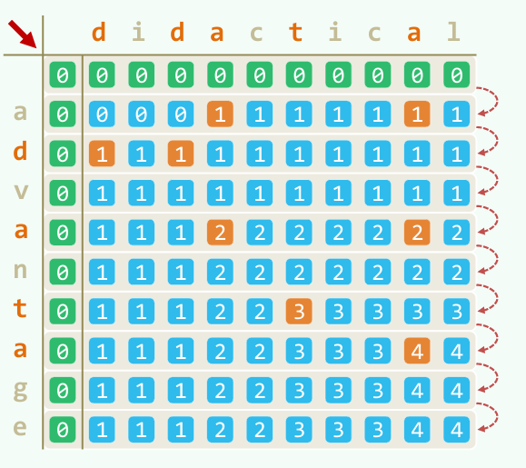

## 序列问题

参考：[](https://www.bilibili.com/video/BV1bM411X72E/?vd_source=b4729a2d5695d1fdbdee4a304fa6bdea "单调队列可视化")  

序列问题也是动态规划中变式丰富的板块，主要有单、多序列，连续、非连续之分  

值得注意的是，需要区分 **序列** 和 **子串** 的概念，前者不要求连续，而后者需要

### 单序列问题

一般而言，我们定义状态：
- `dp[i]` 表示以第 $i$ 个元素结尾的子序列（或串）满足条件的最优值

这是因为只有确定了结尾，处理第 $i + 1$ 个数时才能明确能否接在其后

#### 最长上升子序列(Longest Increasing Subsequence, LIS)  

> 给定一个无序的整数数组，找到其中最长上升子序列的长度

状态转移方程：$dp[i] = \max_{0 \le j < i, nums[j] < nums[i]} \{dp[j]\} + 1$

```C++
vector<int> dp(n + 1, 1);
int max_len = 1;
for (int i = 1; i < n; i++) {
    for (int j = 0; j < i; j++) {
        if (nums[j] < nums[i]) {
            dp[i] = max(dp[i], dp[j] + 1);
        }
    }
    max_len = max(max_len, dp[i]);
}
```

#### 最大子数组和

> 给定一个整数数组 nums，找到一个具有最大和的连续子数组，返回其最大和

在考虑第 $i$ 个数时，有两种选择：  
- 加入前面的子数组：if dp[i - 1] 是正数，接上去
- 重新开始一个新的子数组：if dp[i - 1] 是负数，那不如不加，会拖累第 $i$ 个数，重新开始计算

由此，只需计算 dp[i] 的最大值即可，状态转移方程为 $dp[i] = \max(nums[i], dp[i-1] + nums[i])$

```C++
vector<int> dp(n, 0);
dp[0] = nums[0];
int max_res = dp[0];
for (int i = 1; i < n; i++) {
    dp[i] = max(nums[i], nums[i] + dp[i - 1]);
    max_res = max(max_res, dp[i]);
}
```

很明显，此处只需要用到 dp[i] 和 dp[i - 1]，因此只需要用到两个数记录结果即可，在优化空间上设置 `pre` 和 `max_res` 即可（Kadane 算法）   

### 多序列问题

在处理多序列问题时，需要采用多维 dp，定义状态：  
- $dp[i][j]$ 表示 $S_1$ 的前 $i$ 个字符与 $S_2$ 的前 $j$ 个字符之间的某种最优关系  

在计算 dp[i][j] 时，需要进行三种选择：
- 配对成功：看 $S_1[i]$ 是否等于 $S_2[j]$
- 舍弃一方：跳过 $S_1[i]$ 或者跳过 $S_2[j]$

#### 最长公共子序列(longest Common Subsequence, LCS)

> 给定两个字符串，求它们最长的公共子序列（不要求连续）的长度

```C++
vector<vector<int>> dp(m + 1, vector<int>(n + 1, 0));
for (int i = 1; i <= m; i++) {
    for (int j = 1; j <= n; j++) {
        if (str1[i - 1] == str2[j - 1]) {
            dp[i][j] = dp[i - 1][j - 1] + 1;
        } else {
            dp[i][j] = max(dp[i - 1][j], dp[i][j - 1]);
        }
    }
}
```

  

此外还有基因编辑相关的诸多变式，大多就是对于不同情况的代价估计  