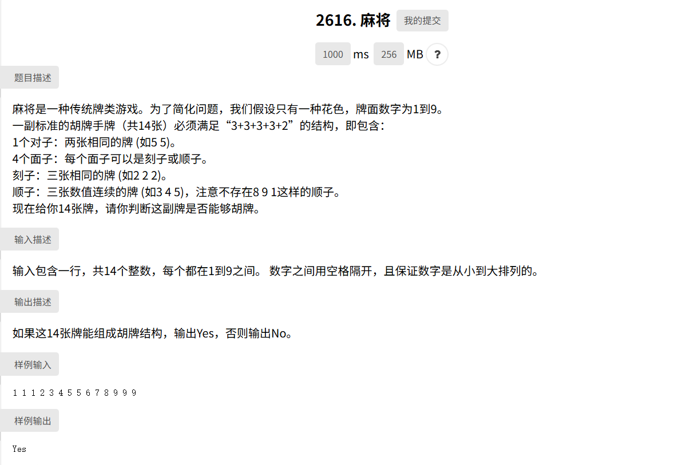
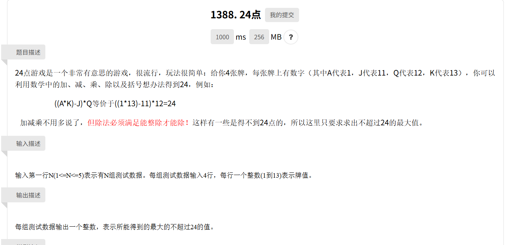
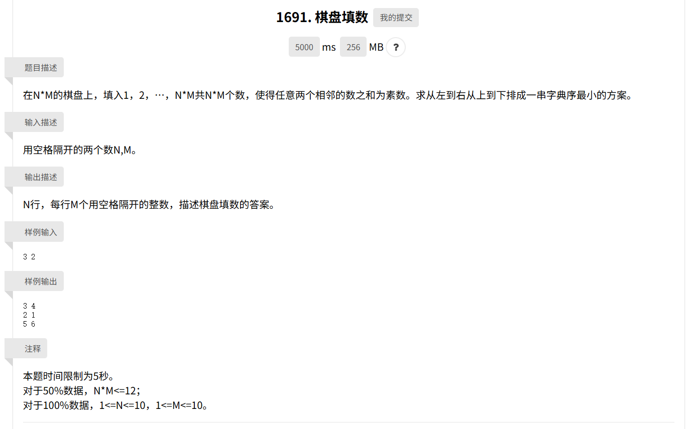

## 回溯与判定问题

回溯的运用场景更多是，需要枚举每一种可能的状态，逐步尝试的情景

### 判定问题

- `hw12` 的 `mahjong.cpp` 麻将胡牌判定问题
- `hw14` 的 `24point.cpp` 凑24点问题
- `hw14` 的 `chess.cpp` 棋盘填数问题

都是很好的示例







### 搜索算法的回溯

在利用 BFS 或 DFS等搜索算法计算路径时，如何将路径回溯出也是一个挑战  
以 BFS 为例，可以使用一个 map 储存当前节点的父节点  

```C++
int N;   // 节点个数

void BFS(int start, int target, const vector<vector<int>>& adj) {
    queue<int> q;
    vector<bool> visited(N, 0);
    map<int, int> parent;
    q.push(start);
    visited[start] = 1;
    parent[start] = -1;
    bool found = 0;
    while (!q.empty()) {
        int cur = q.front;
        q.pop();
        if (cur == target) {
            found = 1;
            break;
        }
        for (auto& nei : adj[cur]) {
            if (!visited[nei]) {
                visited[nei] = 1;
                parent[nei] = cur;
                q.push(nei);
            }
        }
    }
    if (found) {
        vector<int> path;
        for (int v = target; v != -1; v = parent[v]) {
            path.push_back(v);
        }
        for (int i = path.size() - 1; i >= 0; i++) {
            cout << path[i] << (i == 0 ? "" : "->");
        }
        cout << endl;
    } else {
        cout << "Not found" << endl;
    }
}
```