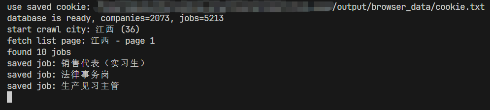

# 招聘信息网站爬虫、查询与数据分析

王宇康 计51 2024010091

## 项目展示

项目实现了 **数据爬取、mysql 存储、django web 展示和关键词搜索功能** 功能

数据来源 [国家大学生就业服务平台](https://www.ncss.cn/)，目前包括 5200+ 岗位信息，2000+ 公司信息

### 功能展示


*爬虫过程输出*


*web 首页：职位列表*


*web 公司列表*


*搜索关键字 python 后结果*


*职位详情页*


*跳转结果：查看原始职位页面*


*公司详情页*

## 具体实现

```text
job_page/
├── README.md
├── main.py                         # 爬虫入口，爬取数据并写入 mysql
├── requirements.txt
├── config/
│   ├── db_config.json
│   └── ncss_config.py
├── crawler/
│   ├── downloader.py
│   ├── parser.py
│   ├── login.py
│   └── utility.py
├── database/
│   ├── db_client.py
│   └── sql_statements.py
├── example/                        # 网站 curl、html、json 示例
├── output/
│   ├── browser_data/               # 浏览器数据和 cookie 等
│   ├── raw_html/
│   └── raw_json/
└── web/
    ├── manage.py                   # web 入口
    ├── job_web/                    # django 项目配置
    └── jobs/
        ├── models.py
        ├── services.py 
        ├── views.py
        ├── templates/jobs/         # html 模板
        └── static/jobs/            # css 和 image
```

### `main.py`

串联 config、crawler 和 database 三部分，实现完整的数据爬取和入库流程

主要功能：
- 读取命令行参数，决定爬取全部地区还是单个地区
- 获取登录 cookie
- 创建 downloader、parser 和 db_client
- 初始化数据库表
- 按地区和页码循环爬取数据
- 解析岗位和公司信息
- 将解析后的数据保存到 mysql
- 统计爬取结果
- 程序结束时关闭数据库连接

主要接口：

```python
def parse_args():
    """读取命令行参数，目前支持 --city 参数"""

def choose_area_items(area_choice):
    """根据用户输入选择要爬取的地区"""

def crawl(downloader, parser, db_client, area_items) -> stats:
    """遍历爬取地区和 page，并更新数据，每爬取一定页数后会休息一段时间"""

def main():
    """程序主入口，负责初始化对象并调用 crawl"""
```

`main` 实现逻辑：
1. 读取命令行参数
   - 根据 --city 选择地区
2. 尝试从环境变量 NCSS_COOKIE 读取 cookie
   - 如果环境变量没有 cookie，使用 NCSSLoginManager 打开浏览器，让用户手动登录并保存 cookie
3. 创建 NCSSDownloader、NCSSParser、DBClient
4. 初始化数据库表
5. 调用 crawl 执行爬取
   - 按地区和 page 进行遍历列表页，并爬取列表页中的所有详情页，job 和 company
   - 从详情页跳转到 company 详情页爬取公司简介
   - 将爬取的数据存入 mysql 中
6. 打印爬取结果

### config/

`config/` 文件夹用于存放项目运行的配置项

#### `db_config.json`

保存 mysql 连接配置

#### `ncss_config.py`

保存 ncss 爬虫相关配置，包括：
- `BASE_URL`：网站基础地址
- `LIST_API_URL`：列表页 json 接口地址
- `SEARCH_PAGE_URL`：列表页 url
- `DEFAULT_HEADERS`：默认请求头，模拟浏览器发请求
- `DEFAULT_PARAMS`：列表页接口默认参数
- `AREA_CODES`：爬取的地区名称和地区的编码

### database/

负责数据库操作

#### `sql_statements.py`

保存项目需要的 sql 语句，包括建表、插入、统计和查询  

数据库包含两张表：
- `companies`：保存公司信息
- `jobs`：保存招聘岗位信息

主要 sql 语句：
- `create_company_table`：创建公司表
- `create_job_table`：创建岗位表
- `insert_company`：插入公司数据；如果公司已存在，则更新公司信息
- `insert_job`：插入岗位数据；如果岗位已存在，则更新岗位信息
- `select_company_id_by_source_id`：根据来源网站和来源公司 id 查询公司主键 id
- `select_company_id_by_name`：当没有来源公司 id 时，根据来源网站和公司名称查询公司主键 id
- `select_job_id_by_source_id`：根据来源网站和来源岗位 id 查询岗位主键 id
- `select_job_id_by_title`：当没有来源岗位 id 时，根据来源网站、岗位名称和公司 id 查询岗位主键 id
- `count_companies`：统计公司数量
- `count_jobs`：统计岗位数量

#### `db_client.py`

封装 mysql 数据库操作类 `DBClient`，负责读取数据库配置、建立连接、创建表、保存公司和岗位数据、统计数据数量

主要对外接口：

```python
class DBClient:
    def __init__(self, filepath) -> DBClient:
        """读取 db_config.json 连接 mysql"""

    def close():
        """关闭数据库连接"""

    def init_table():
        """创建 companies 和 jobs 两张表"""
    
    def save_job_with_company(company_data: dict, job_data: dict) -> (company_id, job_id):
        """在同一个事务里保存公司和岗位数据，并建立岗位与公司的关联"""
    
    def count_data() -> (company_count, job_count):
        """统计当前数据库中的公司数量和岗位数量"""
```

### crawler/

负责爬取和解析 ncss 网站的数据

#### `downloader.py`

封装请求和保存原始数据的类 `NCSSDownloader`，负责保存请求头和 cookie，请求并保存列表页 json，岗位详情页 html，公司详情页 html，以及请求失败时自动重试，每次请求后随机延迟

主要对外接口：

```python
class NCSSDownloader:
    def __init__(self, cookie="") -> NCSSDownloader:
        """创建 requests session，设置默认请求头，如果传入 cookie 则加入请求头"""

    def fetch_list_json(area_name, area_code, page_num) -> filepath:
        """请求某个地区某一页的岗位列表 json，保存到本地后返回文件路径"""

    def fetch_detail_html(job_id) -> filepath:
        """根据岗位 id 请求岗位详情页 html，保存到本地后返回文件路径"""

    def fetch_company_html(company_id, company_href) -> filepath:
        """根据公司 id 或公司链接请求公司详情页 html，保存到本地后返回文件路径"""

    def rest():
        """爬取一定数量数据后长时间休息"""
```

每次爬取加入随机延迟，提高爬取的稳定性

#### `parser.py`

封装数据解析类 `NCSSParser`，解析 downloader.py 保存的 raw_html 和 raw_json，并得到最终入库的 `company_data` 和 `job_data`

主要对外接口：

```python
class NCSSParser:
    def parse_list_json(filepath) -> list:
        """读取列表页 json 文件，返回岗位列表"""

    def parse_detail_html(filepath) -> dict:
        """读取岗位详情页 html，解析岗位详情和公司基础信息"""

    def parse_company_summary(filepath) -> str:
        """读取公司详情页 html，解析公司简介"""

    def parse_job(job_item: dict, detail_data=None, company_summary="") -> (company_data, job_data):
        """合并列表页和详情页数据，返回公司数据和岗位数据"""
```

使用 css 选择器解析，先用 BeautifulSoup 将 html 转成树形结构，再用选择器定位标签，最后提取文本或属性

#### `login.py`

封装登录和 cookie 获取类 `NCSSLoginManager`，由于 ncss 的部分列表数据需要登录后才能访问，所以程序通过 Playwright 打开浏览器，让用户手动完成登录并保存 cookie，后续请求接口时直接使用该 cookie

主要对外接口：

```python
class NCSSLoginManager:
    def __init__(self, headless=False) -> NCSSLoginManager:
        """设置浏览器是否使用无头模式"""

    def get_cookie() -> str:
        """读取本地 cookie；如果没有，则打开浏览器让用户登录并保存 cookie"""
```

#### `utility.py`

保存 crawler 中会复用的工具函数，主要负责构造请求参数和 url

主要接口：

```python
def build_list_params(area_code, page_num) -> dict:
    """根据地区编码和页码构造列表页接口参数"""

def build_detail_url(job_id) -> str:
    """根据岗位 id 构造岗位详情页 url"""

def build_company_url(company_id, company_href) -> str:
    """根据公司 id 或公司链接构造公司详情页 url"""
```

### web/

`web/` 部分使用 django 实现招聘信息展示和搜索功能
- `Django`：负责 web 项目的路由、视图、模板渲染和数据库查询
- `Django ORM`：将 mysql 中的 `jobs` 和 `companies` 表映射为 Python 类，方便查询
- `Django Template`：负责生成职位列表页、公司列表页、详情页和搜索结果页
- `Paginator`：实现分页功能
- `Q` 查询：实现多字段模糊搜索
- `HTML + CSS`：实现页面结构和样式
- `static` 静态资源：保存 css 文件和默认公司图片

#### Django 项目配置

`job_web/settings.py` 是 Django 项目配置文件，包括：
- 从 `config/db_config.json` 中读取 mysql 配置
- 使用 `django.db.backends.mysql` 连接已有数据库
- 注册 `jobs` 应用
- 配置模板系统
- 配置静态文件路径
- 设置语言为中文，时区为 `Asia/Shanghai`

#### `models.py`

定义了两个模型：
- `Company`：对应 mysql 中的 `companies` 表
- `Job`：对应 mysql 中的 `jobs` 表

#### `services.py`

集中处理数据查询逻辑，主要功能有：
- 查询岗位列表并分页
- 查询公司列表并分页
- 查询岗位详情
- 查询公司详情
- 查询某个公司下的所有岗位
- 根据关键词搜索岗位或公司
- 构造分页页码窗口

**搜索：**  
搜索通过读取 q 作为搜索关键词，读取 type 判断搜索职位还是公司，然后根据类型不同在 title、description、tags、city 或者 name、industry、summary 中模糊匹配，然后返回结果数量、耗时和分页结果

使用的算法是基于数据库的模糊匹配查询，通过 django 的 `Q` 对象组合多个查询条件，实现一个关键词匹配多个字段

#### `views.py`

负责处理浏览器请求，包括以下页面：
- `job_list`：职位列表页
- `job_detail`：职位详情页
- `company_list`：公司列表页
- `company_detail`：公司详情页
- `search`：搜索结果页


视图函数接收 request，然后调用 services.py 中的查询函数，组织模板需要的 context，最后调用 render 返回 html 页面

例如职位列表页只负责调用 `paginate_jobs(request)` 得到分页对象，然后交给 `job_list.html` 显示，具体怎么查询和分页由 `services.py` 完成

#### `urls.py`

负责配置页面路径，主要路由：
- `/`：首页，显示职位列表
- `/jobs/`：职位列表页
- `/jobs/<job_id>/`：职位详情页
- `/companies/`：公司列表页
- `/companies/<company_id>/`：公司详情页
- `/search/`：搜索结果页

#### templates 和 static

存放页面模板 html 和静态 css, image 等文件，模板设计使用了 django 的模板继承，所有页面继承 `base.html`

## 数据分析

由于暂时未对爬取的数据做格式化处理，因此选择格式较为统一的 salary 进行分析  

一些辅助函数：为了篇幅简洁，不详细说明，仅提取主要函数的简要逻辑，详细在 `/script/analysis_utils` 中

```python
REGION_PINYIN = {           # 地区中文-拼音映射表
    "北京": "Beijing",
    ...
    "台湾": "Taiwan",
}

def get_connection():
    """读取 db_config.json，连接数据库"""
    
def fetch_jobs():
    """读取 jobs 表中的数据"""
    sql = "SELECT title, city, salary, education, tags, description FROM jobs"""
    
def parse_salary(salary_text):
    """提取 salary，并取平均值作为最终结果"""
    numbers = re.findall(r"(\d+(?:\.\d+)?)k", text)
    return (float(numbers[0]) + float(numbers[1])) / 2 or float(numbers[0]) or None

def get_region(city):
    """提取 city，用前两个字段作为结果"""
    return city[:2] or None


def chinese_region_to_pinyin(region):
    """建立映射"""
    return REGION_PINYIN.get(region)


def get_education_group(education):
    """提取 education"""
    return "Master" or "Bachelor" or "Junior College" or "No Limit"


def get_language_groups(job):
    """读取 job 的 title, tags, description 信息，检索 language 关键字，返回该工作的类别（允许多个）"""
    return result

def build_stats(values):
    """返回统计结果，包括岗位数，薪资平均值，中位数"""
    return {"count": len(values), "average": mean(values), "median": median(values)}

def print_table(title, rows, headers):
    """格式化打印结果"""
```

### 不同地区的薪资对比

详细在 `/script/salary_by_region.py` 中，下面代码仅包括主逻辑

```python
def main():
    jobs = fetch_jobs()     # 从 mysql 中检索 jobs 的信息
    region_salary = {}      # 储存不同地区的薪资结果
    for job in jobs:
        salary = parse_salary(job.get("salary"))            # 提取 salary 
        region = get_region(job.get("city"))                # 提取 region
        if salary is None or region is None:
            continue
        region_name = chinese_region_to_pinyin(region)
        if region_name is None:
            continue
        add_to_group(region_salary, region_name, salary)    # 加入到 region_salary 字典中
    stats = []
    for region, values in region_salary.items():            # 统计每一个 region 的结果
        item = build_stats(values)
        stats.append(
            {
                "region": region,
                "count": item["count"],
                "average": item["average"],
                "median": item["median"],
            }
        )
```

最终结果（按平均值排序处理后）：


| Region | Job Count | Average(k/month) | Median(k/month) |
| :--- | :--- | :--- | :--- |
|Beijing   | 498 | 8.31 | 7.00 |
|Hunan     | 293 | 8.06 | 6.50 |
|Hubei     | 365 | 7.65 | 7.00 |
|Shanghai  | 500 | 7.63 | 6.50 |
|Guangdong | 500 | 7.43 | 6.50 |
|Shandong  | 500 | 7.18 | 6.50 |
|Hebei     | 388 | 7.16 | 6.50 |
|Jiangsu   | 500 | 7.06 | 6.50 |
|Sichuan   | 500 | 7.00 | 6.12 |
|Zhejiang  | 500 | 6.99 | 6.25 |
|Fujian    | 328 | 6.99 | 6.50 |
|Tianjin   | 320 | 6.69 | 6.00 |
|Jiangxi   | 45  | 6.34 | 6.00 |

得出结论：**不同地区之间岗位的平均薪资差异并不明显，较为发达的地区如北京也仅比江西多出 2k/month 的平均薪资，中位数的差异更小，大部分岗位的薪资与地区无明显关系**

### 不同学历的薪资对比

详细在 `/script/salary_by_education.py` 中，下面代码仅包括主逻辑

```python
def main():
    jobs = fetch_jobs()              # 从 mysql 中检索 jobs 的信息
    education_salary = {             # 存储不同学历要求的薪资结果
        "Junior College": [],
        "Bachelor": [],
        "Master": [],
        "No Limit": [],
    }
    for job in jobs:
        salary = parse_salary(job.get("salary"))                # 提取 salary
        if salary is None:
            continue
        education = get_education_group(job.get("education"))   # 提取学历要求
        add_to_group(education_salary, education, salary)       # 加入到 salary_education 字典中
    rows = []
    for education in ["Junior College", "Bachelor", "Master", "No Limit"]:
        item = build_stats(education_salary[education])
        rows.append(                                            # 统计每一种 education 的结果
            [
                education,
                item["count"],
                f"{item['average']:.2f}",
                f"{item['median']:.2f}",
            ]
        )
```

最终结果：

|Education       |Job Count       |Average(k/month)        |Median(k/month) |
| :--- | :--- | :--- | :--- |
|No Limit        |626             |7.11                    |5.75            |
|Junior College  |2276            |6.46                    |6.00            |
|Bachelor        |2039            |7.83                    |7.00            |
|Master          |298             |11.18                   |10.00           |

得出结论：**薪资水平和学历要求成正相关，学历要求越高的平均薪资也越高**

### 不同开发语言的薪资对比

详细在 `/script/language_salary_compare.py` 中，下面代码仅包括主逻辑

```python
# 检索的语言范围
LANGUAGES = ["Python", "Java", "C++", "JavaScript", "Go", "PHP", "SQL"]

def main():
    jobs = fetch_jobs()                                         # 从 mysql 中检索 jobs 的信息
    language_salary = {language: [] for language in LANGUAGES}  # 存储不同开发语言的薪资结果
    for job in jobs:
        salary = parse_salary(job.get("salary"))                # 提取 salary
        if salary is None:
            continue
        languages = get_language_groups(job)
        for language in languages:
            add_to_group(language_salary, language, salary)     # 加入到 language_salary 字典中
    rows = []
    for language in LANGUAGES:
        item = build_stats(language_salary[language])
        rows.append(                                            # 统计每一种 language 的结果
            [
                language,
                item["count"],
                f"{item['average']:.2f}",
                f"{item['median']:.2f}",
            ]
        )
```

最终结果：

|Language        |Job Count       |Average(k/month)        |Median(k/month) |
| :--- | :--- | :--- | :--- |
|C++             |78              |9.69                    |8.75            |
|Python          |101             |8.81                    |7.00            |
|JavaScript      |20              |8.74                    |8.93            |
|Java            |84              |7.46                    |4.50            |
|PHP             |3               |7.08                    |7.00            |
|SQL             |58              |6.79                    |6.50            |
|Go              |4               |6.50                    |7.25            |

得出结论：**比较来看，目前最有前景的开发语言是 C++ 和 python，二者的平均薪资，岗位数量等综合考虑都优于其他开发语言**
