# OJ 系统实验报告

## 项目概述

**项目目标：** 完成一个小型但功能完善的 Online Judge 系统，满足可运行、可持久化、可审计、带安全隔离等特点， student可以提交 python 代码并获得评测结果，teacher 和admin 可以管理题目、查看完整日志、重新评测以及维护系统数据

**已完成功能：**  
- 用户注册、登录、登出、获取当前用户信息
- student、teacher、admin 三种用户类型以及用户权限和禁用状态校验
- 题目增删改查，student 可查看公开信息，teacher/admin 查看完整信息
- python 代码提交、异步评测、状态流转、重新评测
- 测试点日志、审计日志、日志脱敏与截断
- sqlite 持久化、重启后数据保留
- 备份创建、备份列表、备份恢复和损坏备份校验
- 前端登录态维护、题目浏览、提交、提交记录、teacher 与 admin 管理页面

**未完成功能：** 实验文档基础要求均已完成，作业之外的功能扩展，提升体验方面的内容没有完成，例如修改密码、多语言评测、题解/讨论区、排行榜、在线 IDE 等

**持久化方式：** 选择 **sqlite**，默认数据库文件为 `data/oj.db`  

**进阶模块：** 完成 **adv2 安全隔离** 的 docker 沙盒测评，实现了 cpu 时间限制，内存限制并返回 MLE，禁止网络访问，限制工作目录范围

## 系统架构

项目采用分层结构，实现不同业务和功能分离  

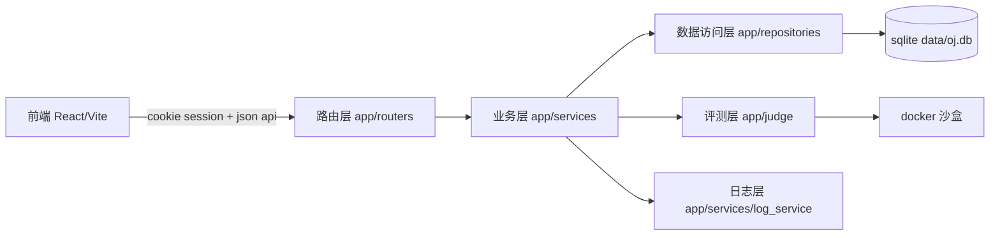

核心文件树

```text
oj/
├── app/
│   ├── main.py
│   ├── core/
│   ├── judge/
│   ├── models/
│   ├── repositories/
│   ├── routers/
│   ├── services/
│   └── utils/
├── frontend/
│   ├── src/
│   │   ├── api/
│   │   ├── components/
│   │   ├── pages/
│   │   └── styles/
│   └── vite.config.ts
├── tests/
├── data/
├── backups/
└──temp/
```

### `app/main.py`

应用入口，创建 fastapi 实例、挂载 sessionmiddleware、注册业务路由，并集中处理校验错误和内部错误

### `app/core/`

`core` 用于统一项目的全局配置等
- `config.py`：读取数据库路径、备份目录、session 密钥、默认admin 账号等配置
- `errors.py`：定义统一业务异常，例如未登录、无权限、资源不存在、冲突、请求错误和系统错误
- `responses.py`：统一返回格式，包括响应，错误，页码信息
- `security.py`：负责密码哈希和校验

### `app/models/`

`models` 存放 pydantic 请求和响应模型，以及项目的枚举信息
- `enums.py`：定义用户角色、提交状态、评测结果、题目难度等枚举信息
- `user.py`：定义用户注册、登录、更新、获取的响应模型
- `problem.py`：定义题目创建和修改的响应模型，校验题号、字段、测试点、分值总和和限制范围
- `submission.py`：定义提交创建的响应模型，约束语言和源码内容
- `log.py`：定义评测日志和审计日志相关响应模型
- `backup.py`：定义备份记录相关响应模型

### `app/routers/`

`routers` 是 api 路由层，负责请求参数、依赖注入和响应包装
- `auth.py`：认证接口
  - `POST /api/auth/register`
  - `POST /api/auth/login`
  - `POST /api/auth/logout`
  - `GET /api/auth/me`
- `problems.py`：题目接口
  - `GET/POST /api/problems`
  - `GET/PUT/DELETE /api/problems/{problem_id}`
- `submissions.py`：提交接口
  - `POST /api/submissions`
  - `GET /api/submissions`
  - `GET /api/submissions/{submission_id}`
  - `GET /api/submissions/{submission_id}/logs`
  - `POST /api/submissions/{submission_id}/rejudge`
- `logs.py`：teacher/admin 日志接口
  - `GET /api/logs`
  - `GET /api/audit-logs`
- `users.py`：admin 用户管理接口
  - `GET /api/users`
  - `GET /api/users/{user_id}`
  - `PUT /api/users/{user_id}`
- `admin.py`：admin 备份接口
  - `POST /api/admin/backups`
  - `GET /api/admin/backups`
  - `POST /api/admin/backups/{backup_id}/restore`
- `deps.py`：通用路由依赖，包括当前用户、角色校验和分页参数

### `app/services/`

`services` 是业务层，定义实现功能的逻辑
- `auth_service.py`：注册、登录、登出、从 session 获取当前用户，禁止 `is_active=False` 的用户访问
- `problem_service.py`：题目列表、详情、创建、修改和删除，按用户类型裁剪返回视图
- `submission_service.py`：创建提交、筛选提交、查询提交详情、重新评测、后台执行评测和提交状态流转
- `log_service.py`：提交日志、全量日志、审计日志查询，按用户类型视图脱敏和截断日志
- `user_service.py`：admin 查询用户、修改角色和启用状态，并写入审计日志
- `backup_service.py`：创建备份、列出备份、校验并恢复备份，恢复失败时保护当前数据库

### `app/repositories/`

`repositories` 是数据访问层，对 sqlite 进行直接操作
- `database.py`：创建连接、事务、初始化表结构、创建默认 admin 
- `users.py`：用户增查改和公开字段裁剪
- `problems.py`：题目和测试点的增删改查
- `submissions.py`：提交创建、列表筛选、状态置为 running、完成提交、重新评测重置
- `logs.py`：测试点日志、teacher 日志筛选、审计日志写入和查询
- `backups.py`：备份记录创建、查询和列表

### `app/judge/`

`judge` 是评测层
- `compare.py`：输出规范化和标准输出比较，处理换行、行末空白和末尾空行
- `docker_runner.py`：创建临时目录、检查 docker 环境、启动容器、限制资源、读取输出、终止超时容器、生成测试点日志
- `result.py`：汇总多个测试点结果，按 `SE/MLE/TLE/RE/WA/AC` 优先级计算最终结果和分数

### `app/utils/`

`utils` 存放通用辅助函数
- `ids.py`：生成业务 ID
- `time.py`：生成 UTC ISO 8601 时间字符串
- `text.py`：文本截断、错误脱敏、 student 可见错误摘要

### frontend/

前端部分位于 `frontend/src/`
- `api/client.ts` 统一封装 `/api` 请求并携带 cookie
- `App.tsx` 负责登录态恢复、页面切换和角色入口
- `pages/` 实现登录、题目列表/详情、提交记录/详情、teacher 题目管理、admin 用户管理和备份管理
- `components/` 存放布局、错误框、确认框、状态标签等复用组件
- `styles/` 按基础样式、布局、表格、表单、弹窗和响应式样式拆分，存放 css 样式文件

## 数据设计

主要数据都存放在 sqlite 中

**users table**

```sql
CREATE TABLE users (
    id TEXT PRIMARY KEY,
    username TEXT NOT NULL UNIQUE,
    password_hash TEXT NOT NULL,
    role TEXT NOT NULL CHECK (role IN ('student', 'teacher', 'admin')),
    is_active INTEGER NOT NULL DEFAULT 1,
    created_at TEXT NOT NULL,
    updated_at TEXT NOT NULL
);
```

**problems table**

```sql
CREATE TABLE problems (
    id TEXT PRIMARY KEY,
    title TEXT NOT NULL,
    description TEXT NOT NULL,
    input_description TEXT NOT NULL,
    output_description TEXT NOT NULL,
    samples_json TEXT NOT NULL,
    constraints_text TEXT NOT NULL,
    time_limit REAL NOT NULL,
    memory_limit INTEGER NOT NULL,
    difficulty TEXT NOT NULL CHECK (difficulty IN ('easy', 'medium', 'hard')),
    tags_json TEXT NOT NULL,
    created_at TEXT NOT NULL,
    updated_at TEXT NOT NULL
);
```

**test_cases table**

```sql
CREATE TABLE test_cases (
    id INTEGER PRIMARY KEY AUTOINCREMENT,
    problem_id TEXT NOT NULL,
    case_id TEXT NOT NULL,
    input_data TEXT NOT NULL,
    expected_output TEXT NOT NULL,
    score REAL NOT NULL,
    is_hidden INTEGER NOT NULL,
    UNIQUE (problem_id, case_id),
    FOREIGN KEY (problem_id) REFERENCES problems(id) ON DELETE CASCADE
);
```

**submissions table**

```sql
CREATE TABLE submissions (
    id TEXT PRIMARY KEY,
    user_id TEXT NOT NULL,
    problem_id TEXT NOT NULL,
    language TEXT NOT NULL,
    source_code TEXT NOT NULL,
    status TEXT NOT NULL CHECK (status IN ('pending', 'running', 'finished', 'failed')),
    result TEXT,
    score REAL NOT NULL DEFAULT 0,
    total_time REAL,
    created_at TEXT NOT NULL,
    started_at TEXT,
    finished_at TEXT
);
```

**case_logs table**

```sql
CREATE TABLE case_logs (
    id INTEGER PRIMARY KEY AUTOINCREMENT,
    submission_id TEXT NOT NULL,
    case_id TEXT NOT NULL,
    result TEXT NOT NULL,
    score REAL NOT NULL,
    time_used REAL NOT NULL,
    memory_used REAL,
    exit_code INTEGER,
    stdout TEXT NOT NULL,
    stderr TEXT NOT NULL,
    input_data TEXT NOT NULL,
    expected_output TEXT NOT NULL,
    is_hidden INTEGER NOT NULL,
    message TEXT NOT NULL,
    created_at TEXT NOT NULL
);
```

**audit_logs table**

```sql
CREATE TABLE audit_logs (
    id TEXT PRIMARY KEY,
    operator_id TEXT,
    action TEXT NOT NULL,
    target_type TEXT,
    target_id TEXT,
    success INTEGER NOT NULL DEFAULT 1,
    detail TEXT NOT NULL,
    created_at TEXT NOT NULL
);
```

**backups table**

```sql
CREATE TABLE backups (
    id TEXT PRIMARY KEY,
    backup_id TEXT NOT NULL UNIQUE,
    path TEXT NOT NULL,
    manifest_json TEXT NOT NULL,
    created_at TEXT NOT NULL
);
```

其中 problem 与 test_case 使用主外键关联，submission 与 log 围绕 `submission_id` 关联，方便恢复、审计和筛选

## 核心实现

此部分涉及代码为了便于展示，均经过逻辑简化，删去了边界检查等，详情可查看对应文件

### 异步启动评测

首先 `app/routers/submissions.py` 接收 `POST /api/submissions` 请求

```python
@router.post("")
async def create_submission(data, background_tasks, user=Depends(current_user)):
    submission = submission_service.create_submission(data, user)
    background_tasks.add_task(submission_service.evaluate_submission, submission["id"])
    return api_response(submission, code=status.HTTP_202_ACCEPTED)
```

通过 `current_user` 确认用户已经登录后，路由调用 `app/services/submission_service.py` 中的 `create_submission()`，检查题目是否存在

```python
def create_submission(data, user):
    problem = problems.get_problem(data.problem_id, include_cases=True)
    if problem is None:
        raise NotFound("problem not found")
    submission = submissions.create_submission(user["id"], problem["id"], data.language, data.source_code)
    return _public_submission(submission)
```

`app/repositories/submissions.py` 的 `create_submission()` 向 `submissions` 表插入一条记录，初始状态为 `pending`，`result = null`，并生成提交编号

```python
def create_submission(*args):
        "status": "pending",
    submission = {...,"status": "pending", "result": None, ...}
    conn.execute("INSERT INTO submission ...")
    return submission
```

然后路由把 `submission_service.evaluate_submission()` 加入 fastapi `BackgroundTasks`，接口立即返回 `202 Accepted` 和 `submission_id`，前端跳转到提交详情页，之后通过刷新/轮询查询状态  

响应结束后，后台任务执行 `evaluate_submission()`，再把状态从 `pending` 改为 `running`，后续调用 `app/judge/docker_runner.py` 的 `judge_python()` 完成实际评测

```python
async def evaluate_submission(submission_id):
    submission = submissions.get_submission(submission_id)
    if submission is None or submission["status"] != "pending":
        return
    problem = problems.get_problem(submission["problem_id"], include_cases=True)
    running = submissions.mark_running(submission_id)
    result = await judge_python(submission["source_code"], problem)
```

### 运行和终止代码

运行代码的完整实现集中在 `app/judge/docker_runner.py`  

接着上一部分提到的调用 `judge_python()` 完成测评，`judge_python()` 为每次提交创建独立工作目录，路径形如 `temp/{problem_id}-{random_id}`，把代码写入 `main.py`，但值得注意的是 fastapi 主进程只写文件，不直接执行代码

```python
async def judge_python(source_code, problem):
    work_dir.mkdir(parents=True, exist_ok=True)       # 创建临时目录
    try:
        # 写入 main.py 和 runner.py
        (work_dir / "main.py").write_text(source_code, encoding="utf-8")
        (work_dir / "runner.py").write_text(RUNNER_SOURCE, encoding="utf-8")
        # 准备 docker 环境
        docker_error = await docker_environment_error(settings.docker_image)
        # 每个测例单独用 docker 环境运行
        for case in test_cases:
            case_result = await run_case(dir_info, problem_info, docker_info)
        return summarize_cases(cases)
    except Exception:
        return {error_info}
    finally:
        shutil.rmtree(work_dir, ignore_errors=True)   # 清理目录
```

`docker_environment_error()` 先检查 `docker info` 和目标镜像是否可用，不可用时直接返回 `SE`

对每个测试点调用 `run_case()`
1. 通过 `asyncio.create_subprocess_exec()` 启动 `docker run` 子进程，容器内执行 `python runner.py {time_limit}`
2. `runner.py` 再用 `subprocess.run([sys.executable, "main.py"], timeout=limit)` (RUNNER_SOURCE 中) 执行学生代码
3. `runner.py` 将 stdout、stderr 写入 `stdout.bin`、`stderr.bin`，并把超时、退出码、耗时写入 `meta.json`
4. 外层进程用 `asyncio.wait_for(process.communicate(...), timeout=docker_timeout)` 控制容器总超时，超时执行 `process.kill()`、`docker rm -f container_name`
5. 每个测试点结束后读取 `meta.json`、`stdout.bin`、`stderr.bin`，生成结构化 case log

```python
async def run_case(dir_info, problem_info, docker_info):
    command = [docker run ... -v {work_dir}:/work:rw -w /work image python runner.py {time_limit}]
    try:
        # 创建子进程
        process = await asyncio.create_subprocess_exec(*command, stdin, stdout, stderr)
        try:
            stdout_bytes, stderr_bytes = await asyncio.wait_for(process.communicate(input_data.encode("utf-8")),timeout=docker_timeout)
        except asyncio.TimeoutError:
            # 杀死进程，结束容器，返回日志...
        # 读取信息
        meta, stdout, stderr = ...
        # 生成结构化 case log
        if process.returncode == 125:
            return case_log(result_info, message)
        ... 
```

所有测试完成或遇到 `RE/TLE/MLE/SE` 这类停止结果后汇总结果  
`finally` 中执行 `shutil.rmtree(work_dir, ignore_errors=True)` 清理临时目录

### 结果判定

- **AC**：全部测试点输出匹配，且程序正常结束
- **WA**：程序正常运行，但标准化后的输出不一致
- **RE**：程序运行时异常、非 0 退出或输出无法按 utf-8 解码
- **TLE**：执行超过时间限制
- **MLE**：docker 返回 `137`，表示容器因超过 `--memory` 和 `--memory-swap` 限制，从而被系统终止
- **SE**：沙盒、容器、评测器或系统层异常，如 docker 不可用、容器启动失败、任务执行器异常

输出比较会先做统一规范化，将 CRLF/CR 统一成 LF，逐行去掉行末空格和制表符，删除末尾多余空行  

以上是单个测试点的判定逻辑，将所有结果汇总后按照 `SE > MLE > TLE > RE > WA > AC` 的优先级返回结果，得分只统计 AC 测试点的分值

### 提交状态管理

提交状态只允许按合法路径流转：
- `pending -> running -> finished`
- `pending -> failed`
- `running -> finished`
- `running -> failed`

`pending` 和 `running` 时 `result=null`，`finished` 才会有 `AC/WA/RE/TLE/MLE`，`failed` 统一为 `SE`  

teacher/admin 可在提交完成后重新评测，重新评测会清空旧日志并重新进入 `pending`

### 权限校验

权限校验在后端完成，前端会根据用户类型隐藏按钮，但仅用于改善交互，不作为安全边界，校验顺序如下：
1. 检查登录状态，包括是否登录，账号是否存在，账号是否被禁用
2. 检查用户权限，不同的功能仅对特定的用户类型开放，同一功能对不同用户也会返回不同信息，每次调用前都会判断核验用户类型
3. 检查资源归属，即使已经登录，student 只能访问自己的提交和日志

### 测试点隐藏

主要涉及到题目详情页和测评日志，隐藏测试点均做了后端裁剪

题目详情处理流程如下：
1. `app/routers/problems.py` 的 `GET /api/problems/{problem_id}` 先通过 `current_user` 获取当前用户
2. 路由调用 `problem_service.get_problem_detail(problem_id, user)`
3. service 判断用户是否为 `teacher/admin`
   - 如果是 `teacher/admin`，repository 查询题目时传入 `include_cases=True`，返回完整 `test_cases`
   - 否则不读取测试点，且 `_student_detail()` 会再次去掉 `test_cases`、`created_at`、`updated_at` 等

```python
def get_problem_detail(problem_id, user):
    is_teacher = user["role"] in {"teacher", "admin"}
    problem = problems.get_problem(problem_id, include_cases=is_teacher)
    if is_teacher:
        return problem
    return _student_detail(problem)
```

submission 日志：  
- student 可以看到自己 submission 的测试点结果，但隐藏测试点不会返回
- 教师和 admin 可以查看完整日志，同时写入 `VIEW_FULL_JUDGE_LOG` 审计记录

```python
def _student_case_log(log):
    data = _common_case_log(log)
    is_hidden = bool(log["is_hidden"])
    data["stderr"] = sanitize_student_error_message(log["stderr"])
    data["message"] = sanitize_student_error_message(log["message"])
    if not is_hidden:
        data["stdout"] = sanitize_student_error_message(log["stdout"])
        data["expected_output"] = log["expected_output"]
    return data
```

### 日志脱敏和截断

日志处理分为 "入库前保护" 和 "返回前按用户类型裁剪" 两部分
1. `submission_service.evaluate_submission()` 评测完成后遍历每个测试点结果
2. 每个测试点结果生成 case log，调用 `logs.create_case_log()` 写入 sqlite
3. `create_case_log()` 在写入前对 `input_data`、`stdout`、`expected_output` 做 4000 字符截断，对 `stderr` 和 `message` 先截断，再通过正则把本机临时目录、docker `/work/main.py` 等路径替换为 `<submission>/main.py`
4. 日志查询时，`log_service` 再根据角色返回学生视图或教师视图

```python
def create_case_log(log, path):
    data = {"memory_used": None, **log, "created_at": utc_now()}
    for key in ("input_data", "stdout", "expected_output"):
        data[key] = truncate_text(data.get(key))
    data["stderr"] = sanitize_error_message(data.get("stderr"))
    data["message"] = sanitize_error_message(data.get("message"))
    ...
```

脱敏工具位于 `app/utils/text.py`：

```python
def sanitize_error_message(text: str | None, limit: int = 4000) -> str:
    value = truncate_text(text, limit)
    value = LINUX_TEMP_PATH.sub("<submission>/main.py", value)
    value = DOCKER_WORK_PATH.sub("<submission>/main.py", value)
    return WINDOWS_TEMP_PATH.sub(lambda _match: "<submission>/main.py", value)
```

student 视图会把 python traceback 压缩成 "第几行发生运行错误" 的摘要，如果是 `SE`，student 只能看到 `System Error`，不会看到 docker 命令、服务器路径、环境或内部栈信息

### 持久化和恢复

系统选择 sqlite 作为持久化方式，所有用户、题目、测试点、提交、评测日志、审计日志和备份记录都写入 `data/oj.db`

`app/main.py` 启动时调用数据库初始化逻辑 `initialize_database()`

```python
def initialize_database(path):
    create_schema(conn)
    create_default_admin(conn)
```

`app/repositories/database.py` 中的 `create_schema()` 创建 `users`、`problems`、`test_cases`、`submissions`、`case_logs`、`audit_logs`、`backups` 等 table，`create_default_admin()` 在首次启动时创建 default admin 账号

对于备份，当 admin 调用 `POST /api/admin/backups` 时：
1. service 生成 `backup_id` 和备份目录
2. 创建 `manifest.json` 文件，用于记录 `backup_id`、数据库文件名和创建时间等信息
3. 在 `backups` 表中写入备份记录，写入审计日志
4. 复制当前 `oj.db` 到备份目录

```python
def create_backup(user: dict) -> dict:
    backup_id, backup_dir = ...
    manifest = {"backup_id": backup_id, ..., "created_at": utc_now()}
    (backup_dir / MANIFEST_FILE_NAME).write_text(json.dumps(manifest, encoding="utf-8"))
    record = backups.create_backup_record(backup_id, backup_dir, manifest)
    logs.create_audit_log(CREATE_BACKUP, operator_id=user["id"], target_type="backup", target_id=backup_id)
    shutil.copy2(source, backup_dir / DB_FILE_NAME)
```

对于恢复，当 admin 调用 `POST /api/admin/backups/{backup_id}/restore` 时：
1. 根据 `backup_id` 查询备份记录，不存在返回 `404`
2. 读取 `manifest.json`，获取备份 database 文件
3. 校验备份 database 存在、`PRAGMA integrity_check` 为 `ok`，且包含必需表
4. 进行恢复，先把备份数 database 复制到临时 `.restore` 文件，校验临时文件成功后用 `replace()` 原子替换当前数据库 
5. 成功或失败都会写入审计日志

```python
def restore_backup(backup_id, user):
    record = backups.get_backup_record(backup_id)
    manifest = _read_manifest(backup_dir, backup_id)
    backup_db = backup_dir / manifest["database"]
    _validate_backup_db(backup_db)
    _replace_database(backup_db, get_settings().db_path)
    logs.create_audit_log(RESTORE_BACKUP, operator_id=user["id"], target_type="backup", target_id=backup_id)
```

### 前端部分

关于登录部分，主要逻辑如下：
1. 用户首次打开前端时，`App.tsx` 会先调用 `api.me()` 尝试恢复已有会话
2. 如果浏览器还没有 cookie，`GET /api/auth/me` 返回未登录，页面进入 `LoginPage` 
3. 用户输入用户名和密码后，`LoginPage.submit()` 调用 `api.login(username, password)`，如果是注册模式则先调用 `api.register()`，再立即调用 `api.login()` 

```typescript
async function submit(event) {
  event.preventDefault();
  const user = mode === "login"
    ? await api.login(username, password)
    : await registerAndLogin(username, password);
  onLoggedIn(user);
}
```

4. 后端 `POST /api/auth/login` 调用 `auth_service.login()`，校验密码和账号启用状态后执行 `request.session["user_id"] = user["id"]` 
5. `sessionMiddleware` 会把 session 内容签名后写入 cookie，浏览器保存该 cookie 

```python
def login(request, data):
    user = users.get_user_by_username(data.username)
    if user is None or not verify_password(data.password, user["password_hash"]):
        raise Unauthorized("invalid username or password")
    if not bool(user["is_active"]):
        raise Forbidden("user is disabled")
    request.session[SESSION_USER_ID] = user["id"]
```

6. 登录成功后，前端 `onLoggedIn(user)` 将用户写入 `App.tsx` 的 `user` 状态，并切换到题目列表页 
7. 后续所有 api 请求仍由 `request()` 发起，由于带有 `credentials: "include"`，浏览器会自动携带 cookie；后端通过 `current_user()` 从 session 中取回当前用户 
8. 页面刷新或重新打开时，`App.tsx` 再次调用 `api.me()` 只要 cookie 仍有效，后端就返回当前用户，前端自动恢复登录态 

```typescript
useEffect(() => {
  api.me()
    .then((current) => {
      setUser(current);
      setView({ name: "problems" });
    })
    .catch(() => setView({ name: "login" }))
    .finally(() => setBooting(false));
}, []);
```

9. 退出登录时，前端调用 `api.logout()`，后端清空 session，前端再清空本地 `user`、`history` 和当前视图 

前端调用后端接口的核心主要在 `api/client.ts`，通过浏览器原生 fetch() 发出请求，`credentials: "include"` 让请求携带 cookie session，后端统一返回 {code, message, data}，前端只取 data

```typescript
async function request<T>(path, init){
  const response = await fetch(`${API_BASE}${path}`, {
    ...init,
    credentials: "include",
    headers: {
      ...(init.body ? { "Content-Type": "application/json" } : {}),
      ...init.headers
    }
  });
  const body = await response.json();
  if (!response.ok) {
    throw new ApiError(body.code || response.status, body.message || "请求失败");
  }
  return body.data as T;
}
```

用户发出请求进入 submission 结果展示页后，前端同时请求提交详情和测试点日志，页面顶部显示提交编号、题号、状态、结果、得分和总耗时，如果有 `source_code`，则展示提交源码  

每个测试点日志显示 `case_id`、结果、分数、耗时、退出码和创建时间，teacher/admin 可看到完整日志，包括 `input_data`、`stdout`、`expected_output` 和 `stderr`，student 只能看到裁剪后的视图  

当提交状态为 `pending` 或 `running` 时，页面每 1.5 秒轮询一次，持续刷新最新结果，并且若提交完成后且用户为 teacher/admin，可点击 "重新评测"，提交新的后台评测任务

## API 说明

主要接口如下

### auth

- `POST /api/auth/register`
  - 权限：公开
  - 参数：`username`、`password`
  - 响应：创建用户并返回用户信息
  - 错误：`422` 参数不合法，`409` 用户名重复
- `POST /api/auth/login`
  - 权限：公开
  - 参数：`username`、`password`
  - 响应：登录成功后写入 cookie session
  - 错误：`401` 账号或密码错误，`403` 用户被禁用
- `POST /api/auth/logout`
  - 权限：登录后
  - 响应：清理会话
- `GET /api/auth/me`
  - 权限：登录后
  - 响应：当前用户信息

### problem

- `GET /api/problems`
  - 权限：登录后
  - 参数：`page`、`page_size`
  - 响应：题目列表分页
- `GET /api/problems/{problem_id}`
  - 权限：登录后
  - 响应：student 返回公开信息，teacher/admin 返回完整配置
  - 错误：`404` 题目不存在
- `POST /api/problems`、`PUT /api/problems/{problem_id}`、`DELETE /api/problems/{problem_id}`
  - 权限：teacher/admin 
  - 参数：题目信息、测试点、限制、难度等
  - 错误：`409` 题号重复，`422` 字段缺失或测试点校验失败

### submission

- `POST /api/submissions`
  - 权限：登录后
  - 参数：`problem_id`、`language=python`、`source_code`
  - 响应：返回 `submission_id`
  - 错误：`404` 题目不存在，`422` 代码为空或格式不合法
- `GET /api/submissions`
  - 权限：登录后
  - 参数：`page`、`page_size`、`problem_id`、`user_id`、`status`、`result`、`start_time`、`end_time`
  - 响应：提交分页列表
  - 错误：`403` 越权查询
- `GET /api/submissions/{submission_id}`
  - 权限：登录后，且只能查看本人或 teacher/admin 可见内容
- `POST /api/submissions/{submission_id}/rejudge`
  - 权限：teacher/admin 
  - 响应：重新提交评测任务，返回 `202`
  - 错误：`409` 当前状态不允许重新评测

### log & backup

- `GET /api/submissions/{submission_id}/logs`
  - 权限：本人或 teacher/admin 
  - 响应： student 视图或完整视图
- `GET /api/logs`、`GET /api/audit-logs`
  - 权限：teacher/admin 
  - 响应：评测日志、审计日志分页
- `POST /api/admin/backups`、`GET /api/admin/backups`、`POST /api/admin/backups/{backup_id}/restore`
  - 权限：admin 
  - 错误：`400` 备份清单损坏，`404` 备份不存在，恢复失败不会破坏当前数据

## 测试结果

`pytest` 自动化测试内容包括实验文档所有 step 的验收要求，详情在 `tests/` 目录下文件  

测试结果为：

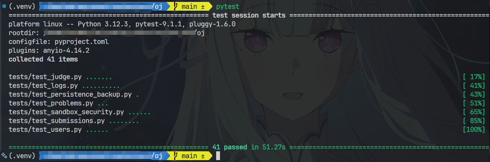

测试内容包括：
- `test_problems.py`
  - 测试 teacher 创建题目、重复编号、非法字段、列表查询、修改和删除流程
  - 测试 student 题目详情不暴露隐藏测试点，无权创建、修改、删除题目
  - 测试题目写入持久化数据源后，重新初始化服务仍可查询
- `test_judge.py`
  - 测试评测器能正确识别 AC、WA、RE、TLE 四类 python 代码
  - 测试多测试点评测会逐点执行并按 AC 测试点累加得分
  - 测试输出比较会忽略行末空格，并统一 windows 与 linux 换行符
  - 测试提交接口在评测前拒绝空白源码并返回 422
  - 测试 student 程序输出非 UTF-8 字节时，评测结果为 RE
  - 测试评测结束后会清理本次提交的临时工作目录
  - 测试评测器自身异常时，提交被标记为 failed/SE
- `test_users.py`
  - 测试注册成功、重复用户名返回 409、密码过短返回 422
  - 测试登录成功、错误密码登录失败、登出后无法访问受保护接口
  - 测试 student 调用 teacher 接口返回 403， teacher 调用 admin 接口返回 403
  - 测试 admin 可以修改普通用户角色，并且响应中返回更新后的公开用户信息
  - 测试 admin 禁用用户后，该用户无法再次登录
  - 测试注册、登录、当前用户和 admin 用户列表接口不返回密码或密码哈希
- `test_submission.py`
  - 测试创建提交立即返回 202 和 submission_id，评测由后台任务处理
  - 测试提交状态按 pending -> running -> finished/failed 的合法顺序变化
  - 测试提交服务保存的评测结果与 step2 中 AC、WA、RE、TLE 的判断一致
  - 测试 student 可查看自己的提交，不能查看其他 student 的提交详情或列表结果
  - 测试 teacher 可以按题目和结果筛选全部 student 提交
  - 测试不存在的题目无法提交，空白源码也无法提交
  - 测试已完成提交不能通过 running 状态更新接口改回 running
  - 测试重新评测要求 teacher 权限，且只能重评 finished/failed 提交
- `test_logs.py`
  - 测试 student 可以查看自己的提交日志，访问他人日志返回 403
  - 测试 student 看不到隐藏输入、隐藏标准答案和隐藏实际输出
  - 测试 teacher 可以查看完整日志字段，且查看后写入审计记录
  - 测试 teacher 日志检索接口支持 problem_id、user_id 和 result 筛选
  - 测试超长 input、stdout、stderr、expected_output 和 message 会被截断并带标记
  - 测试 student 日志中的 Linux、Windows 路径会脱敏，完整 traceback 不会原样暴露
  - 测试 WA、RE、TLE、SE 四类测试点日志结果和消息可以正确返回
  - 测试 admin 可以按 action、operator_id 和 target_id 筛选审计日志
  - 测试数据库重新初始化后，已保存的测试点日志仍然可以查询
  - 测试评测器异常时，提交失败且写入 SE system 测试点日志
- `test_persistence_backup.py`
  - 测试用户、题目、提交和日志重启后仍存在，备份恢复可还原被删除的数据
- `test_sandbox_security.py`
  - 测试 docker 命令包含 cpu、内存、网络禁用和文件系统限制参数
  - 测试容器因内存限制被 kill 时返回 MLE
  - 测试容器启动失败会返回 SE，并保留受控错误信息
  - 测试外层 docker 超时时会 kill 进程并执行 docker rm -f 清理容器
  - 测试评测结束后会清理本次沙箱临时目录
  - 测试沙箱环境检查失败时返回 SE 系统错误

下面是前端页面展示  

<figure style="text-align: center;">
  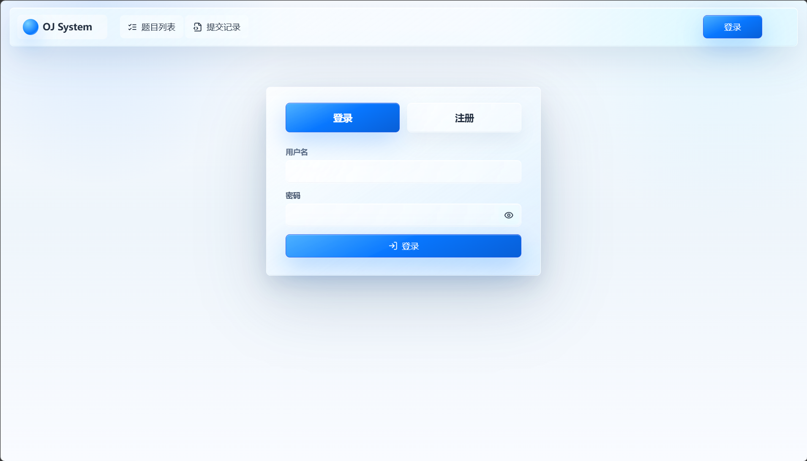
  <figcaption>1. 登录页</figcaption>
</figure>

<figure style="text-align: center;">
  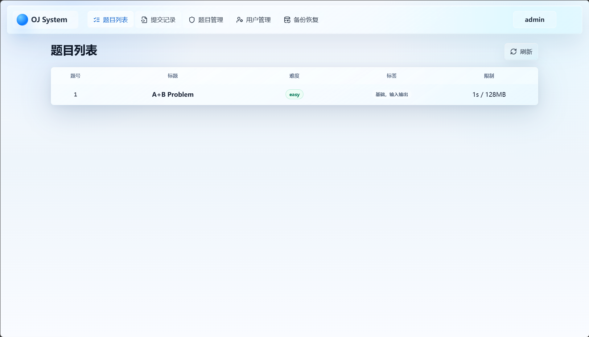
  <figcaption>2. 题目列表页(admin version)</figcaption>
</figure>

<figure style="text-align: center;">
  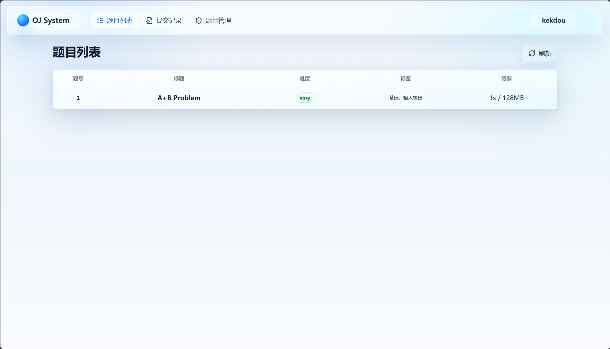
  <figcaption>3. 题目列表页(teacher version)</figcaption>
</figure>

<figure style="text-align: center;">
  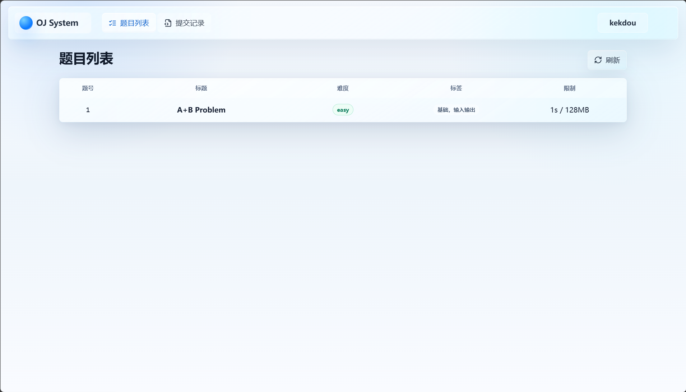
  <figcaption>4. 题目列表页(student version)</figcaption>
</figure>

<figure style="text-align: center;">
  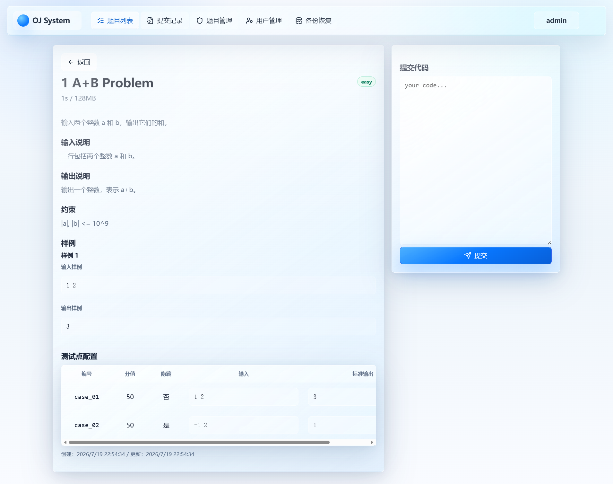
  <figcaption>5. 题目详情页(teacher/admin version)</figcaption>
</figure>

<figure style="text-align: center;">
  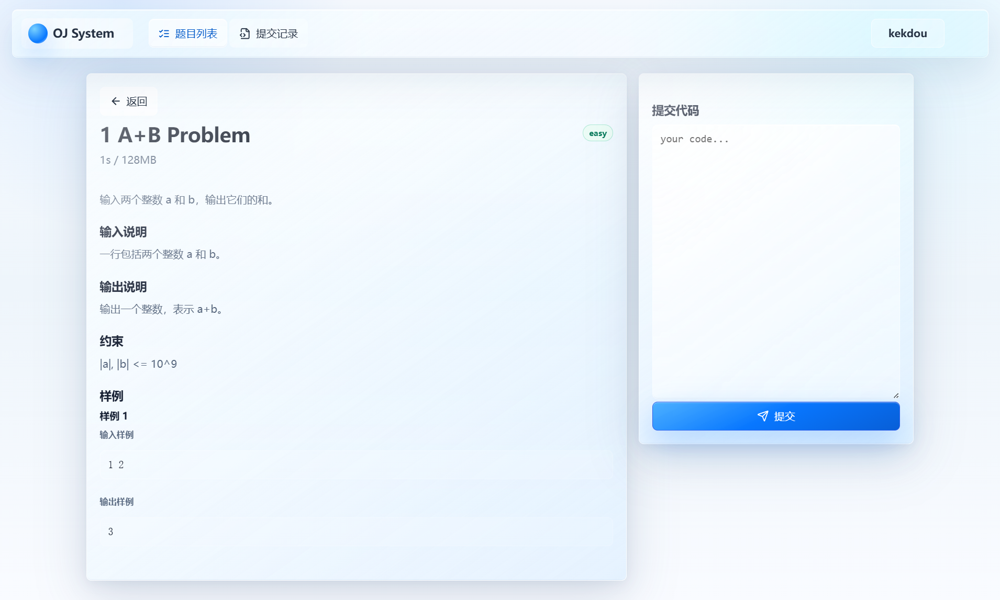
  <figcaption>6. 题目详情页(student version)</figcaption>
</figure>

<figure style="text-align: center;">
  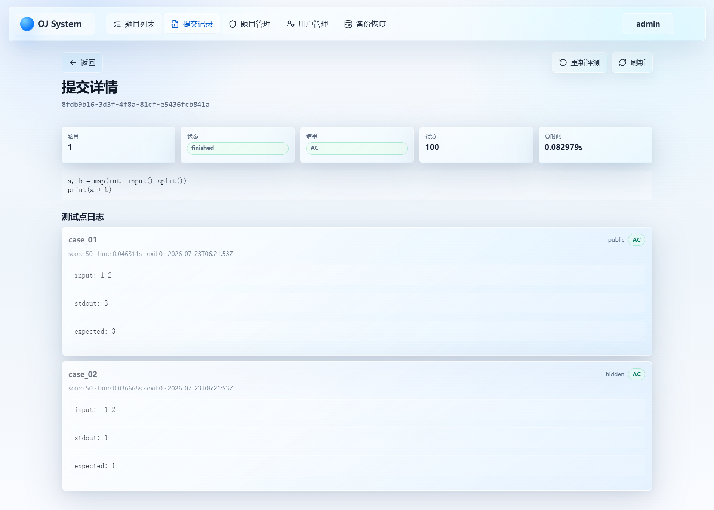
  <figcaption>7. 提交详情页(teacher/admin version)</figcaption>
</figure>

<figure style="text-align: center;">
  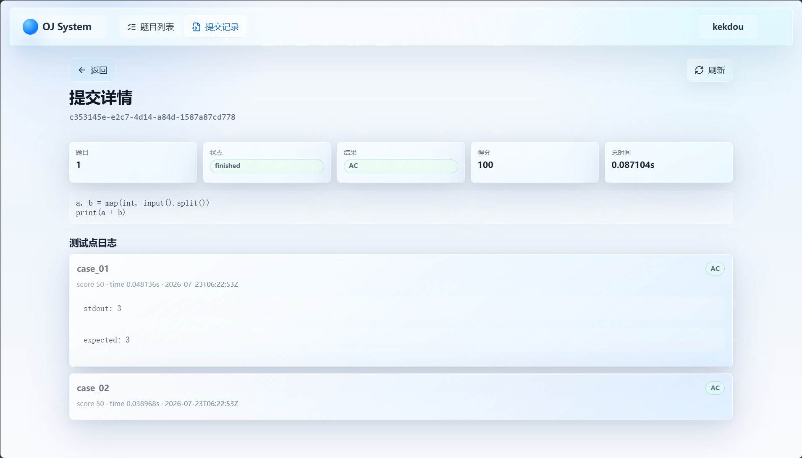
  <figcaption>8. 提交详情页(student version)</figcaption>
</figure>

<figure style="text-align: center;">
  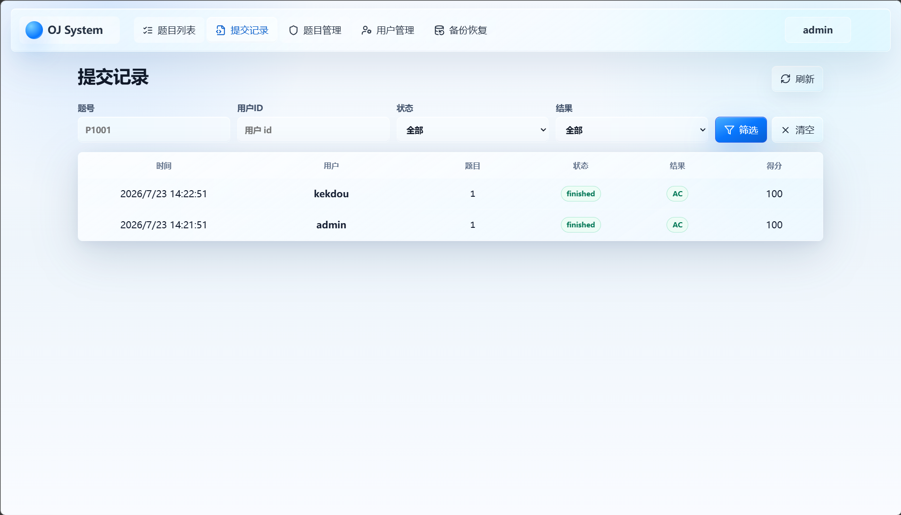
  <figcaption>9. 提交记录页(teacher/admin version)</figcaption>
</figure>

<figure style="text-align: center;">
  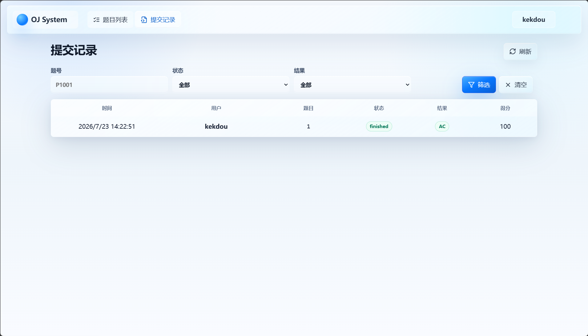
  <figcaption>10. 提交记录页(student version)</figcaption>
</figure>

<figure style="text-align: center;">
  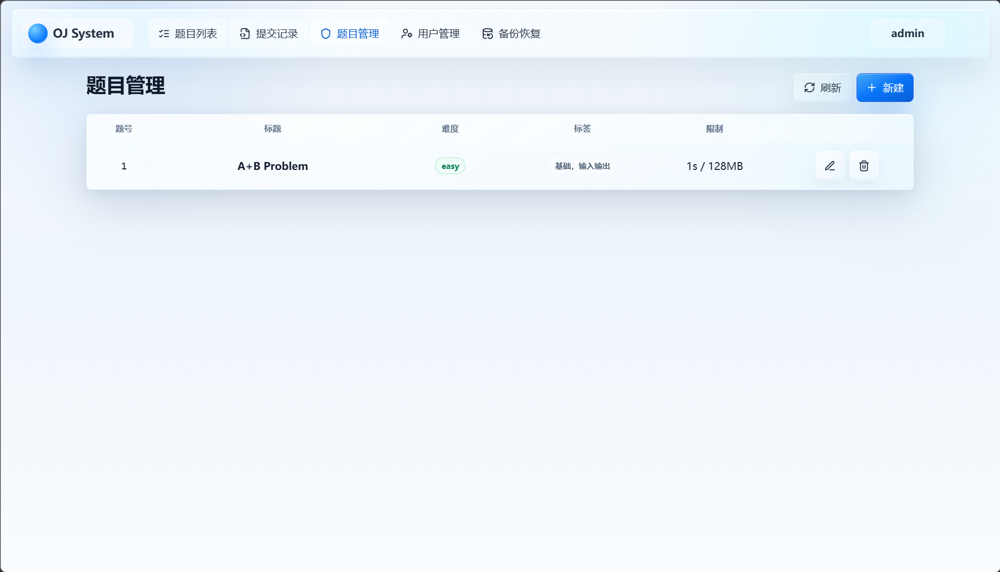
  <figcaption>11. 题目管理页</figcaption>
</figure>

<figure style="text-align: center;">
  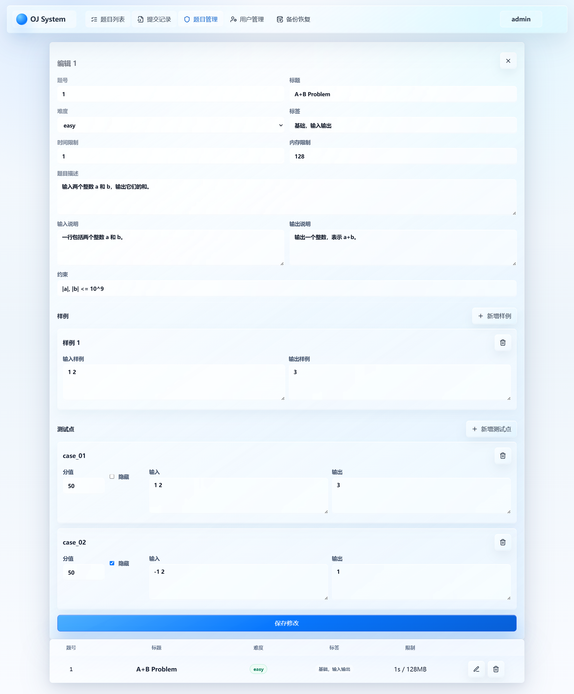
  <figcaption>12. 题目修改页</figcaption>
</figure>

<figure style="text-align: center;">
  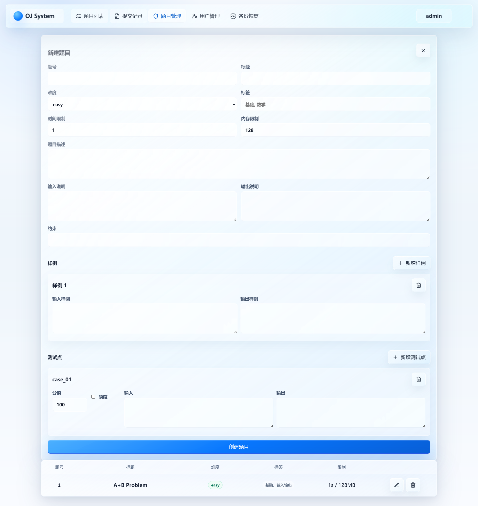
  <figcaption>13. 题目创建页</figcaption>
</figure>

<figure style="text-align: center;">
  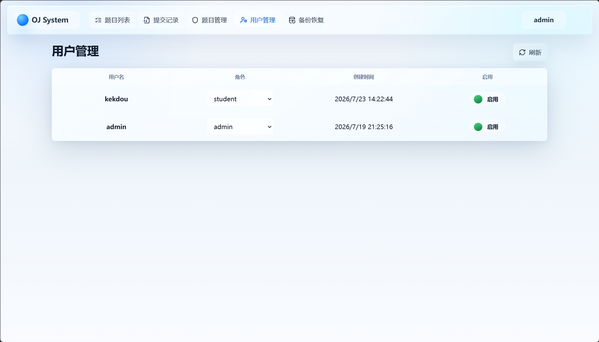
  <figcaption>14. 用户管理页</figcaption>
</figure>

<figure style="text-align: center;">
  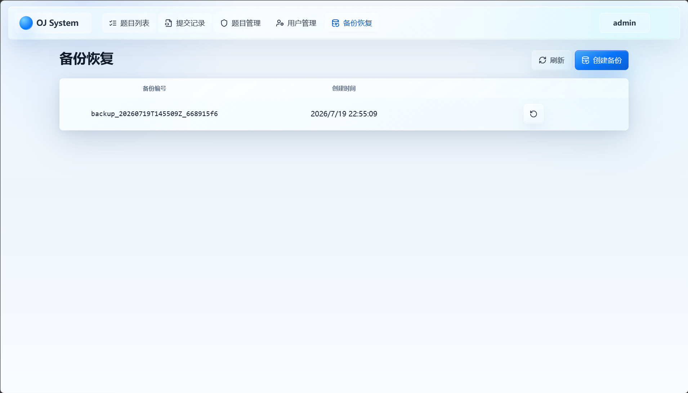
  <figcaption>15. 备份恢复页</figcaption>
</figure>

## 问题与解决过程

### 依赖版本问题

项目进行 pytest 自动化测试时出现 `httpx` 相关 warning，按照指示操作后将依赖更换为 `httpx2`，但又出现新的兼容问题，本项目的后端接口测试主要依赖 fastapi 的 `TestClient`，而 `TestClient` 底层由 starlette 提供，并进一步使用 `httpx` 作为 http 客户端实现，因此形成以下关系

```text
pytest
  -> fastapi.testclient.TestClient
      -> starlette.testclient
          -> httpx
```

所以使用 `httpx2` 会导致项目依赖和 fastapi 官方测试生态不一致，需要写额外的适配代码，增加了维护成本，切换回 `httpx` 后发现是版本过高的问题，导致 fastapi/starlette 版本没有同步匹配，出现旧参数被弃用、新参数不兼容等问题

总结问题出现的原因是对 warning 的含义判断不够准确，错误判断版本边界问题，最终处理方式是统一规定所有依赖的版本限制，以尽可能减少依赖问题

```text
fastapi>=0.110,<0.116
pytest>=8
httpx>=0.27,<0.29
```

### submission 始终返回 `RE`

在 docker desktop 正常运行，容器也能启动的情况下，测例始终返回 `RE`，经过各种测试后发现是 input() 没有正确接收测试数据(hello world 没事)

由于程序测评流程分为 `docker run ... python runner.py` 的外层和 `runner.py` 启动 `main.py` 的内层，测例数据要想正确被 source_code 接收，必须先传给 docker run 的 stdin，然后 runner.py 从自己的 stdin 读取并传给 main.py 的 stdin，最后由 input() 接收

起初没有正确处理好，导致代码执行到 input() 时 stdin 已经结束，抛出异常导致测评器判定为 `RE`

通过搜索引擎与询问 llm，得出解决方案

1. 外层将测试点输入传给 docker 容器后，在 `docker run` 指令上显式补上 `-i`，让容器保持标准输入可用

```python
process.communicate(input_data.encode("utf-8"))

docker run -i ...
```

2. 然后容器内的 `runner.py` 先用 `sys.stdin.buffer.read()` 读取这一整段输入，再通过 `subprocess.run(..., input=input_data)` 传给学生代码

```python
input_data = sys.stdin.buffer.read()

completed = subprocess.run(
    [sys.executable, "main.py"],
    input=input_data,
    stdout=subprocess.PIPE,
    stderr=subprocess.PIPE,
    timeout=limit
)
```

## AI 工具使用说明

使用 codex + chatgpt 辅助实现了
- oj 后端框架的搭建
- docker 沙盒隔离测评
- 前端的美化和后端接口的串联

AI 生成的所有代码均经过人工审查和修改，通过官方文档和多 llm 交叉验证，并且所有实现均会生成 test 文件进行功能正确性验证  
